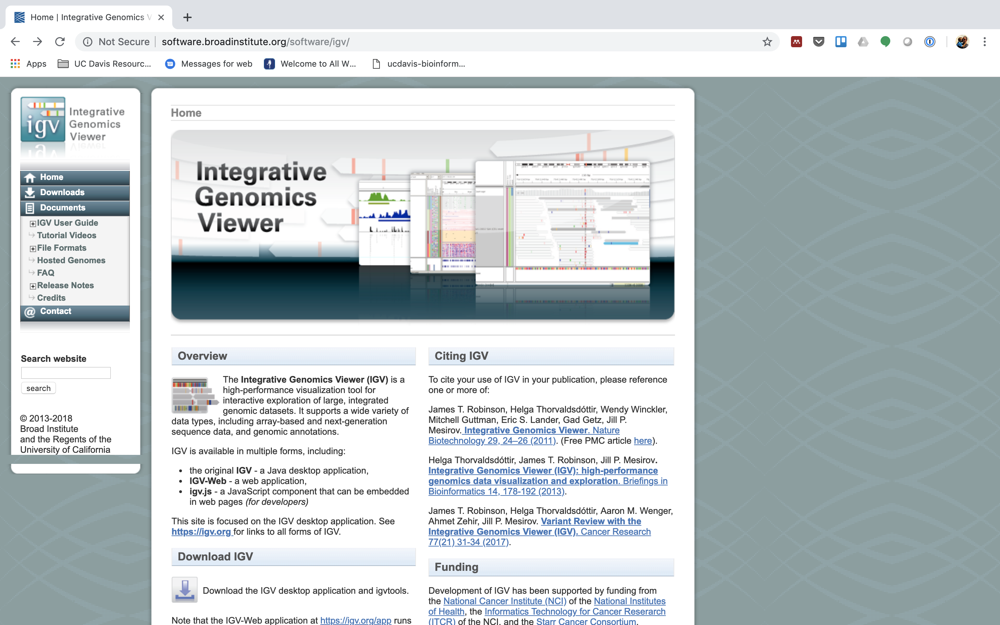
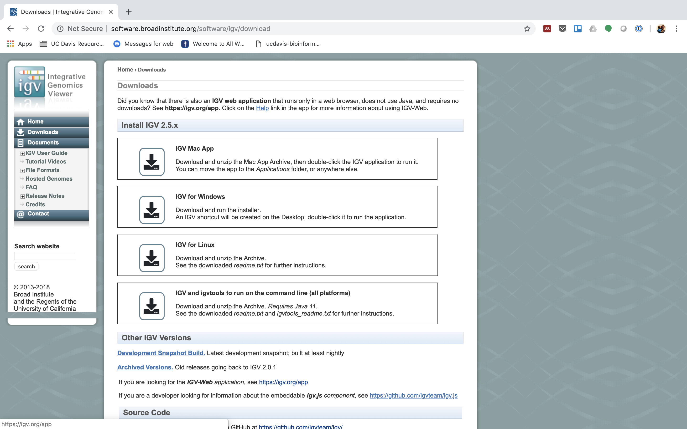
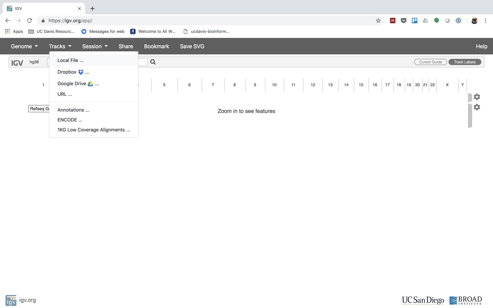
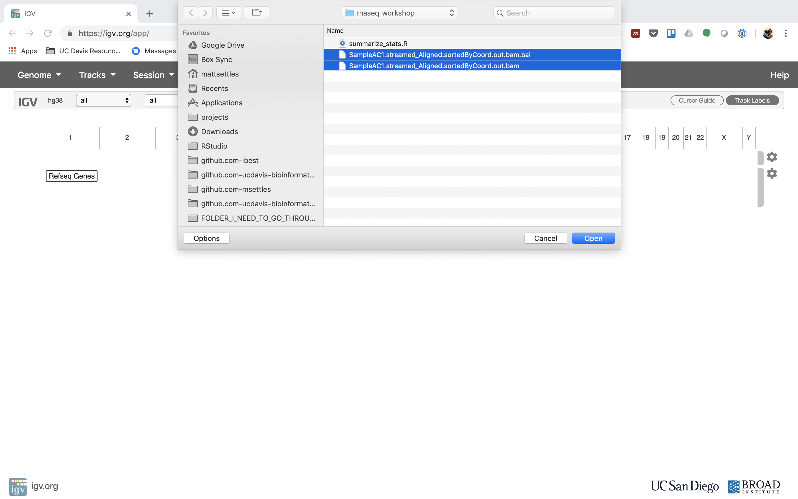
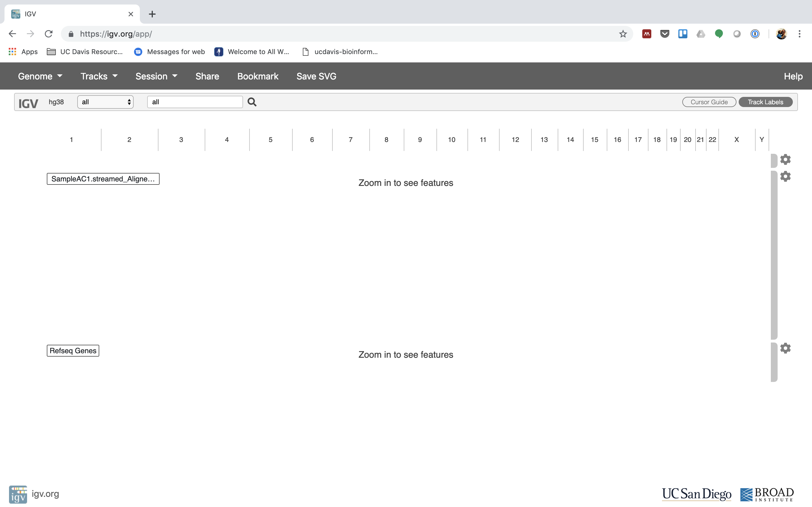
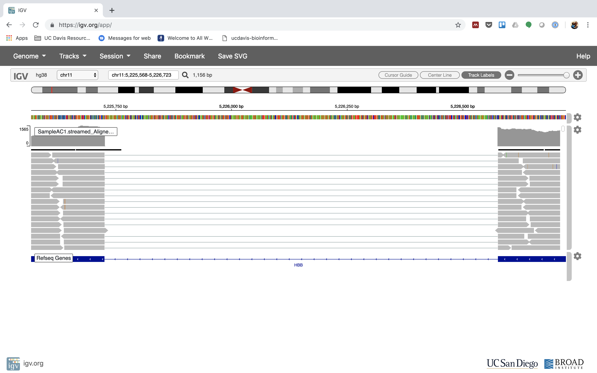
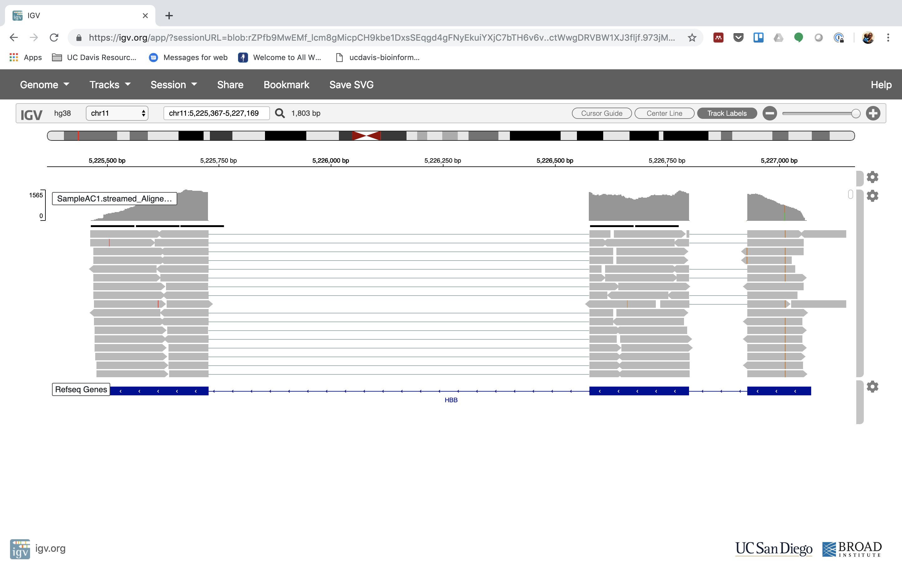
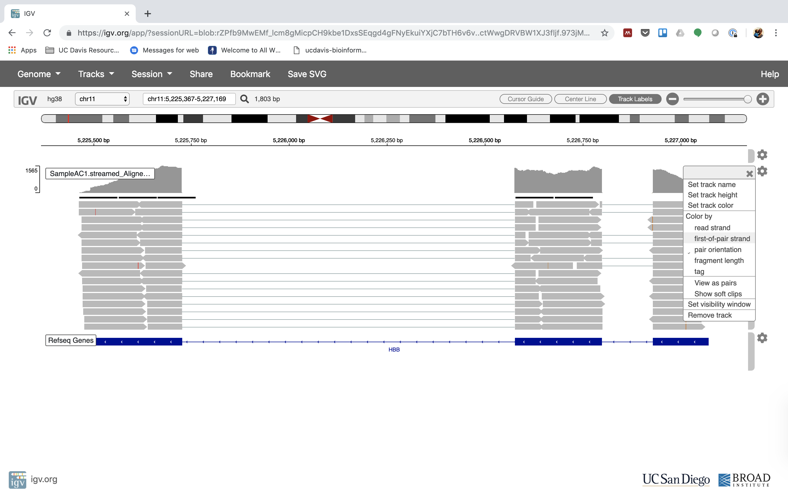
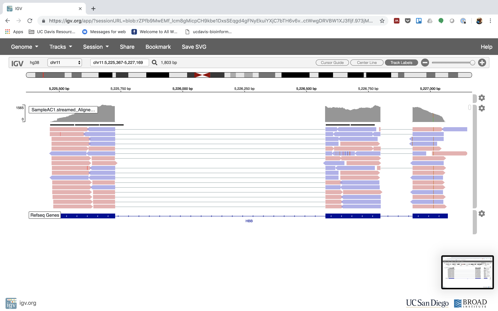

# Alignment to Read Counts & Visualization in IGV

This document assumes [preproc htstream](./preproc_htstream.md) has been completed.

**IF** for some reason it didn't finish, is corrupted or you missed the session, you can copy over a completed copy

    cp -r /share/biocore/workshops/2019_March_RNAseq/HTS_testing /share/workshop/$USER/rnaseq_example/.
    cp -r /share/biocore/workshops/2019_March_RNAseq/01-HTS_Preproc /share/workshop/$USER/rnaseq_example/.
    cp  /share/biocore/workshops/2019_March_RNAseq/summary_hts.txt /share/workshop/$USER/rnaseq_example/.

## Reference sequence and annotation

**1\.** First lets make sure we are where we are supposed to be and that the References directory is available.

    cd /share/workshop/$USER/rnaseq_example

---
**2\.** To align our data we will need the genome (fasta) and annotation (gtf) for human. There are many places to find them, but we are going to get them from the [GENCODE](https://www.gencodegenes.org/human/).

We need to first get the url for the annotation gtf. For RNAseq we want to use the PRI (primary) genome chromosome and corresponding annotation.


We need to first get the url for the genome fasta.


**2\.** We are going to use an aligner called ['STAR'](https://www.ncbi.nlm.nih.gov/pmc/articles/PMC3530905/) to align the data, but first we need to index the genome for STAR. Lets pull down a slurm script to index the human GENCODE version of the genome.

    wget https://raw.githubusercontent.com/ucdavis-bioinformatics-training/2019_March_UCSF_mRNAseq_Workshop/master/scripts/star_index.slurm
    less star_index.slurm

 When you are done, type "q" to exit.

 ```
 #!/bin/bash

 #SBATCH --job-name=star_index # Job name
 #SBATCH --nodes=1
 #SBATCH --ntasks=8
 #SBATCH --time=120
 #SBATCH --mem=32000 # Memory pool for all cores (see also --mem-per-cpu)
 #SBATCH --partition=production
 #SBATCH --reservation=workshop
 #SBATCH --account=workshop
 #SBATCH --output=slurmout/star-index_%A.out # File to which STDOUT will be written
 #SBATCH --error=slurmout/star-index_%A.err # File to which STDERR will be written

 start=`date +%s`
 echo $HOSTNAME

 outpath="References"

 cd ${outpath}
 wget ftp://ftp.ebi.ac.uk/pub/databases/gencode/Gencode_human/release_29/GRCh38.primary_assembly.genome.fa.gz
 gunzip GRCh38.primary_assembly.genome.fa.gz
 FASTA="../GRCh38.primary_assembly.genome.fa"

 wget ftp://ftp.ebi.ac.uk/pub/databases/gencode/Gencode_human/release_29/gencode.v29.primary_assembly.annotation.gtf.gz
 gunzip gencode.v29.primary_assembly.annotation.gtf.gz
 GTF="../gencode.v29.primary_assembly.annotation.gtf"

 mkdir star.overlap100.gencode.v29
 cd star.overlap100.gencode.v29

 module load star/2.7.0e

 call="STAR
      --runThreadN 8 \
      --runMode genomeGenerate \
      --genomeDir . \
      --sjdbOverhang 100 \
      --sjdbGTFfile ${GTF} \
      --genomeFastaFiles ${FASTA}"

 echo $call
 eval $call

 end=`date +%s`
 runtime=$((end-start))
 echo $runtime
 ```

1. The script uses wget to download the fasta and GTF files from GENCODE using the links you found earlier.
1. Uncompresses them using gunzip.
1. Creates the star index directory [star.overlap100.gencode.v29].
1. Change directory into the new star index directory. we run the star indexing command from inside the directory, for some reason star fails if you try to run it outside this directory.
1. Run star in mode genomeGenerate.

This step will take a couple hours. You can look at the [STAR documentation](https://github.com/alexdobin/STAR/blob/master/doc/STARmanual.pdf) while you wait. All of the output files will be written to the star_index directory.

Takes about 1:45 to run.

**IF** for some reason it didn't finish, is corrupted, or you missed the session, you can copy over a completed copy.

    cp -r /share/biocore/workshops/2019_March_RNAseq/References/star.overlap100.gencode.v29 /share/workshop/$USER/rnaseq_example/References/.

## Alignments

**1\.** We are now ready to try an alignment. Let's create an output directory for STAR:

    cd /share/workshop/$USER/rnaseq_example/HTS_testing

and let's run STAR (via srun) on the pair of streamed test files we created earlier. **The command is on multiple lines for readability**:

    srun --time=15:00:00 -n 8 --mem=32g --reservation=workshop --account=workshop --pty /bin/bash

Once you've been given an interactive session we can run STAR. You can ignore the two warnings/errors and you know your on a cluster node because your server will change. Here you see I'm on tadpole, then after the srun command is successful, I am now on drove-13.

```
msettles@tadpole:/share/workshop/msettles/rnaseq_example/HTS_testing$     srun --time=15:00:00 -n 8 --mem=32g --reservation=workshop --account=workshop --pty /bin/bash
srun: job 29372920 queued and waiting for resources
srun: job 29372920 has been allocated resources
groups: cannot find name for group ID 2020
bash: /home/msettles/.bashrc: Permission denied
msettles@drove-13:/share/workshop/msettles/rnaseq_example/HTS_testing$
```

Then run the star commands

    module load star/2.7.0e
    STAR \
    --runThreadN 8 \
    --genomeDir ../References/star.overlap100.gencode.v29 \
    --outSAMtype BAM SortedByCoordinate \
    --quantMode GeneCounts \
    --outFileNamePrefix SampleAC1.streamed_ \
    --readFilesCommand zcat \
    --readFilesIn SampleAC1.streamed_R1.fastq.gz SampleAC1.streamed_R2.fastq.gz

In the command, we are telling star to count reads on a gene level ('--quantMode GeneCounts'), the prefix for all the output files will be SampleAC1.streamed_, the command to unzip the files (zcat), and finally, the input file pair.

Once finished please 'exit' the srun session. You'll know you were successful when your back on tadpole

```
msettles@drove-13:/share/workshop/msettles/rnaseq_example/HTS_testing$ exit
exit
msettles@tadpole:/share/workshop/msettles/rnaseq_example/HTS_testing$
```

##  Now let's take a look at an alignment in IGV.

**1\.** We first need to index the bam file, will use 'samtools' for this step, which is a program to manipulate SAM/BAM files. Take a look at the options for samtools and 'samtools index'.

    module load samtools/1.9
    samtools
    samtools index

We need to index the BAM file:

    samtools index SampleAC1.streamed_Aligned.sortedByCoord.out.bam

**IF** for some reason it didn't finish, is corrupted or you missed the session, you can copy over a completed copy

    cp -r /share/biocore/workshops/2019_March_RNAseq/HTS_testing/SampleAC1.streamed_Aligned.sortedByCoord.out.bam* /share/workshop/$USER/rnaseq_example/HTS_testing

---
**2\.** Transfer SampleAC1.streamed_Aligned.sortedByCoord.out.bam and SampleAC1.streamed_Aligned.sortedByCoord.out.bam (the index file) to your computer using scp or winSCP, or copy/paste from cat [sometimes doesn't work].

In a new shell session on my laptop. **NOT logged into tadpole**.

    mkdir ~/rnaseq_workshop
    cd ~/rnaseq_workshop
    scp msettles@tadpole.genomecenter.ucdavis.edu:/share/workshop/msettles/rnaseq_example/HTS_testing/SampleAC1.streamed_Aligned.sortedByCoord.out.bam* .

Its ok of the mkdir command fails ("File exists") because we aleady created the directory earlier.

---
**3\.** Now we are ready to use IGV. Go to the [IGV page at the Broad Institute](http://software.broadinstitute.org/software/igv/).



And then navigate to the download page, [IGV download](http://software.broadinstitute.org/software/igv/download)


Here you can download IGV for your respective platform (Window, Mac OSX, Linux), but we are going to use the web application they supply, [IGV web app](https://igv.org/app/).


---
**4\.** The first thing we want to do is load the Human genome. Click on "Genomes" in the menu and choose "Human (GRCh38/hg38)".


---
**5\.** Now let's load the alignment bam and index files. Click on "Tracks" and choose "Local File ...".



Navigate to where you transferred the bam and index file and select them both.



Now your alignment is loaded. Any loaded bam file aligned to a genome is called a "track".



---
**6\.** Lets take a look at the alignment associated with the gene __HBB__:


You will need to zoom in by clicking on the plus sign (top right) or zoom out by clicking the negative sign. You also may have to move around by clicking and dragging in the BAM track window.

You can also zoom in by clicking and dragging across the number line at the top. That section will highlight, and when you release the button, it will zoom into that section.




Reset the window by searching for HBB again. And zoom in 1 step.



---
**13\.** See that the reads should be aligning within the exons in the gene. This makes sense, since RNA-Seq reads are from exons. Play with the settings on the right hand side a bit.







---

## Running STAR on the experiment

**1\.** We can now run STAR across all samples on the real data using a SLURM script, [star.slurm](../scripts/star.slurm), that we should take a look at now.

    cd /share/workshop/$USER/rnaseq_example  # We'll run this from the main directory
    wget https://raw.githubusercontent.com/ucdavis-bioinformatics-training/2019_March_UCSF_mRNAseq_Workshop/master/scripts/star.slurm
    less star.slurm

 When you are done, type "q" to exit.

```
msettles@tadpole:/share/workshop/msettles/rnaseq_example$cat star.slurm
#!/bin/bash

#SBATCH --job-name=star # Job name
#SBATCH --nodes=1
#SBATCH --ntasks=8
#SBATCH --time=60
#SBATCH --mem=32000 # Memory pool for all cores (see also --mem-per-cpu)
#SBATCH --partition=production
#SBATCH --reservation=workshop
#SBATCH --account=workshop
#SBATCH --array=1-16
#SBATCH --output=slurmout/star_%A_%a.out # File to which STDOUT will be written
#SBATCH --error=slurmout/star_%A_%a.err # File to which STDERR will be written

start=`date +%s`
echo $HOSTNAME
echo "My SLURM_ARRAY_TASK_ID: " $SLURM_ARRAY_TASK_ID

sample=`sed "${SLURM_ARRAY_TASK_ID}q;d" samples.txt`
REF="References/star.overlap100.gencode.v29"

outpath='02-STAR_alignment'
[[ -d ${outpath} ]] || mkdir ${outpath}
[[ -d ${outpath}/${sample} ]] || mkdir ${outpath}/${sample}

echo "SAMPLE: ${sample}"

module load star/2.7.0e

call="STAR
  --runThreadN 8 \
  --genomeDir $REF \
  --outSAMtype BAM SortedByCoordinate \
  --readFilesCommand zcat \
  --readFilesIn 01-HTS_Preproc/${sample}/${sample}_R1.fastq.gz 01-HTS_Preproc/${sample}/${sample}_R2.fastq.gz \
  --quantMode GeneCounts \
  --outFileNamePrefix ${outpath}/${sample}/${sample}_ \
  ${outpath}/${sample}/${sample}-STAR.stdout 2> ${outpath}/${sample}/${sample}-STAR.stderr"

echo $call
eval $call

end=`date +%s`
runtime=$((end-start))
echo $runtime
```

After looking at the script, lets run it.

    mkdir slurmout
    sbatch star.slurm  # moment of truth!

We can watch the progress of our task array using the 'squeue' command. Takes about 30 minutes to process each sample.

    squeue -u msettles  # use your username

## Quality Assurance - Mapping statistics as QA/QC.

**1\.** Once your jobs have finished successfully, use a script of ours, [star_stats.sh](../scripts/star_stats.sh) to collect the alignment stats. Don't worry about the script's contents at the moment; you'll use very similar commands to create a counts table in the next section. For now:

    cd /share/workshop/$USER/rnaseq_example  # We'll run this from the main directory
    wget https://raw.githubusercontent.com/ucdavis-bioinformatics-training/2019_March_UCSF_mRNAseq_Workshop/master/scripts/star_stats.sh
    bash star_stats.sh


**2\.** Transfer summary_alignments.txt to your computer using scp or winSCP, or copy/paste from cat [sometimes doesn't work],  

In a new shell session on your laptop. **NOT logged into tadpole**.

    mkdir ~/rnaseq_workshop
    cd ~/rnaseq_workshop
    scp msettles@tadpole.genomecenter.ucdavis.edu:/share/workshop/msettles/rnaseq_example/summary_alignments.txt .

Its ok of the mkdir command fails ("File exists") because we aleady created the directory earlier.

Open in excel (or excel like application), you may have to move the header column 1 cell to the right, and lets review.

The table that this script creates ("alignment_stats.txt") can be pulled to your laptop via 'scp', or WinSCP, etc., and imported into a spreadsheet. Are all samples behaving similarly? Discuss ...

## Scripts

slurm script for indexing the genome

[star.slurm](../scripts/star_index.slurm)

slurm script for mapping using slurm task array and star

[star.slurm](../scripts/star.slurm)

shell script for mapping using bash loop and star.

[star.sh](../scripts/star.sh)

shell script to produce summary mapping table

[aln_stats.sh](../scripts/star_stats.sh)
