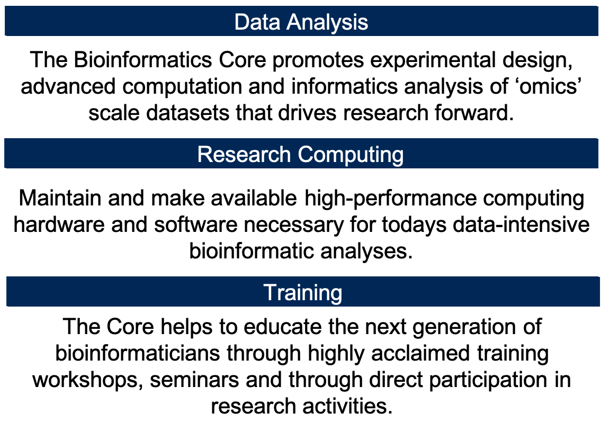

# Quick Introduction to the Workshop and Core

__The mission of the Bioinformatics Core facility is to facilitate outstanding omics-scale research through these activities:__

 

## Staff

 

## Contacts

* Bioinformatics related questions, include but not limited to bioinformatic methods questions, software use, data questions.
  * Bioinformatics.core@ucdavis.edu
* Computing Issues, include but not limited to user account questions, equipment failure/malfunction, software install, software failures (not related to use)
  * helpdesk@genomecenter.ucdavis.edu
* Training courses information
  * training.bioinformatics@ucdavis.edu

## Workshop Goals

* End to End understanding of RNAseq differential
  * Discussions/lectures
  * Technologies
  * Experimental design
  * Cost estimation
  * Workflow
  * mRNA gene expression analysis
* To work through a complete experiment, starting from raw data to completion, including making a few figures.
* Goal is 30-40% lecture/discussion 60-70% hands-on

## Internet

You will need to access the UCSF wireless via your laptop to participate in the hands-on exercises. Please review https://it.ucsf.edu/services/wireless-service for access instructions.

Many academic (and some non-academic) institutions are part of Eduroam. (See "List of Institutions" under
"Members" at https://www.eduroam.us/ to find out if your institution is a member.) Please make sure you
can log into Eduroam with your device at your home institution, which will make things easier once you come to UCSF.

If your institution is not a member of Eduroam, you can still access the open wireless through "UCSFguest".

## Workshop Materials

Workshop materials are all posted on github, and publicly available

http://bioinformatics.ucdavis.edu/training/events/

* Github main page:

	https://github.com/ucdavis-bioinformatics-training
* This RNAseq Workshop

  https://ucdavis-bioinformatics-training.github.io/2018-June-RNA-Seq-Workshop/  

  https://github.com/ucdavis-bioinformatics-training/2018-June-RNA-Seq-Workshop

## Computing Cluster

Course will be conducted on our servers and compute cluster .  
tadpole.genomecenter.ucdavis.edu

Everyone should get an account.  
https://computing.genomecenter.ucdavis.edu	 

Request an account -> sponsor "Bioinformatics Core Workshop"

If you already have an account on our systems, then please tell us your username.

Cluster usage will be under the slurm reservation  ‘workshop’

Reservation will last 1 full week after the workshop and allow you to practice or run analyze your own data.

**workshop       ACTIVE  2019-03-09T10:46:16  2019-03-22T00:00:00  12-12:13:44  drove-[4,13,18]**

## Industry Sponsor Lunch and Learns

* [Lexogen](https://www.lexogen.com/)
* [Qiagen](https://www.qiagen.com/us/)
* [Illumina](https://www.illumina.com/)
* [10X * Genomics](https://www.10xgenomics.com/)

##  Upcoming Workshops

Now in our 12th year of training researchers, the UC Davis Bioinformatics Core invites you to attend one or more of our 2019 workshops. The following workshops are suitable for beginners, and are also of interest to those with some data analysis experience.

For more information on these and other events, and to register, go to https://registration.genomecenter.ucdavis.edu/

**March 11-14: RNA-Seq Workshop @ UCSF**  
**August 19-23: RNA-Seq Workshop @ UC Davis**

This popular workshop contains a rich collection of lectures and hands-on sessions, covering both theory and tools associated with command-line RNA-seq data analysis. Topics include experimental design, cost estimation, data generation, and analysis of RNA-Seq data generated on the Illumina sequencing platform, as well as post differential expression analyses, such as gene set enrichment analysis, Gene Ontology/Pathway analysis, and generation of relevant figures and tables.

Participants will explore software and protocols, create and modify workflows, and diagnose/treat problematic data utilizing high performance computing services. Exercises will be performed with provided datasets, using command-line interaction and with RStudio.  (This workshop does not cover single-cell RNA-Seq)

For more information and to register, go to https://registration.genomecenter.ucdavis.edu/.

**June 24-27: Single-Cell RNA-Seq Workshop @ UC Davis**  
**July 1-3: Single-Cell RNA-Seq Workshop @ UCSF**

This workshop will cover experimental design, data generation, and analysis of single-cell RNA sequencing data (primarily generated using the 10x platform) on the command line and within the R statistical programming language. Participants will explore software and protocols, create and modify workflows, and diagnose/treat problematic data utilizing high performance computing services. The primary packages used for analysis will be 10x software (for sequence reads to counts) and the R packages (e.g, Seurat) for downstream analysis.

For more information and to register, go to https://registration.genomecenter.ucdavis.edu/.

**September 3-6: Microbial Community Analysis @ UC Davis**

This workshop covers amplicon-based microbial analysis and methodology using high throughput sequencing technologies.  Topics will include:

* Differences between communty analysis with amplicons versus shotgun metagenomics and metatranscriptomics
* Experimental design
* Sequence data quality assurance and expectations
* Processing of amplicon reads (using the python application dbcAmplicons)
* Analysis of community structure (using R and vegan)
* Lecture on metagenome assembly and metatranscriptome assembly and annotation
* Post analysis and visualization (using R)

Exercises will be performed with provided datasets, using command-line interaction and with RStudio.

For more information and to register, go to https://registration.genomecenter.ucdavis.edu/.

**December: Bioinformatis Prerequisites Workshop @ UC Davis**

This workshop will cover the basic prerequisites required before performing bioinformatics analysis, including basic command line and high performance computing concepts, how to install software, use help, run applications, and advanced command line (shell scripting, pipes, etc.). Also covered will be basic R programming, basic statistical concepts, and model building. There are no prerequisites for this workshop other than an interest in bioinformatics!

If you would like to take a look at the documentation from previous workshops, see https://bioinformatics.ucdavis.edu/training/documentation/.

Questions?  Contact us at training.bioinformatics@ucdavis.edu
Email List Note:  If you received this email directly from training.bioinformatics@ucdavis.edu, you are currently subscribed to one of our announcements lists. To subscribe / unsubscribe from the Bioinformatics Core email lists, please follow the instructions at the bottom of http://bioinformatics.ucdavis.edu/contact-us/.
